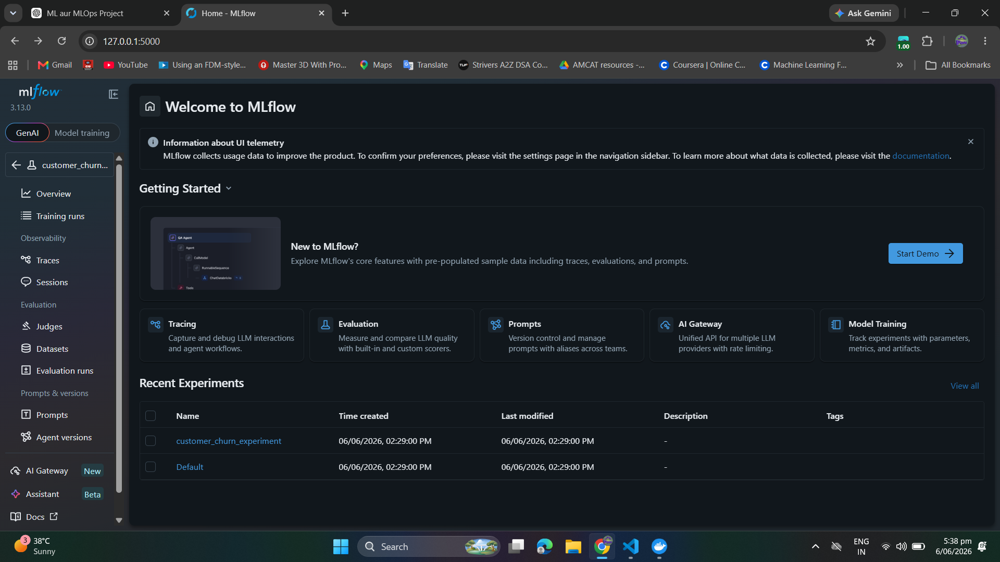
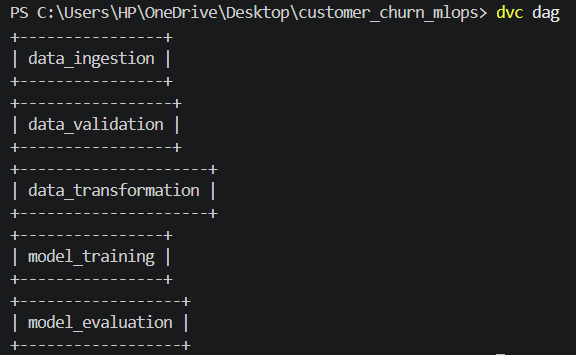
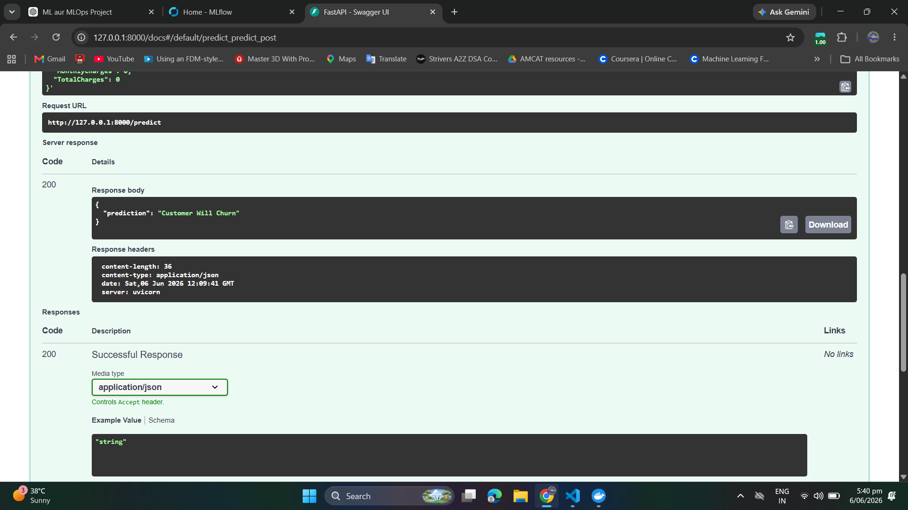
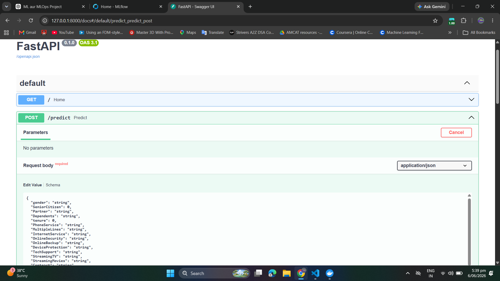
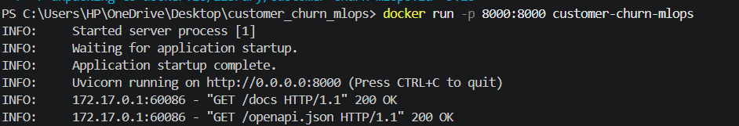
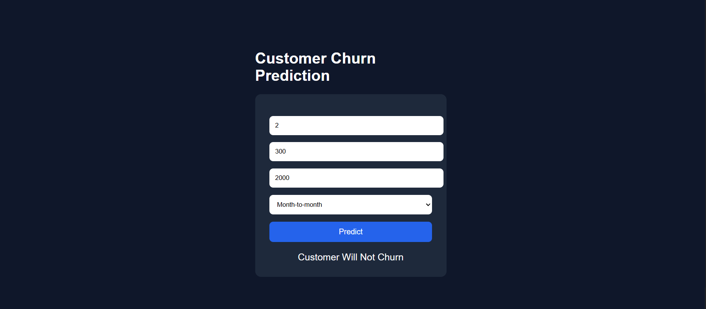

# End-to-End Customer Churn Prediction MLOps Pipeline

Production-grade Machine Learning pipeline with DVC, MLflow, FastAPI, Docker, and CI/CD.

---

## Project Overview

This project is a complete end-to-end Machine Learning and MLOps pipeline built for Customer Churn Prediction.

The primary focus of this project is not frontend development, but production-grade ML Engineering and MLOps practices including:

* Modular pipeline architecture
* Reproducible workflows
* Experiment tracking
* Model serving
* Docker containerization
* CI/CD integration
* Production-style project structure

The system predicts whether a telecom customer is likely to churn based on customer subscription and billing information.

---

# Key MLOps Features

* Modular ML pipeline architecture
* DVC pipeline orchestration
* MLflow experiment tracking
* FastAPI model serving
* Docker containerization
* GitHub Actions CI pipeline
* Reproducible workflows
* Artifact management
* Production-style project structure
* Automated training pipeline
* API-based inference system

---

# Tech Stack

## Machine Learning

* Python
* Scikit-learn
* Pandas
* NumPy
* XGBoost

## MLOps

* DVC
* MLflow
* Docker
* GitHub Actions
* FastAPI

## Frontend

* HTML
* CSS
* JavaScript

---

# Project Architecture

```text
Data Ingestion
      ↓
Data Validation
      ↓
Data Transformation
      ↓
Model Training
      ↓
MLflow Tracking
      ↓
FastAPI Serving
      ↓
Docker Deployment
```

---

# Project Structure

```text
customer_churn_mlops/
│
├── .github/workflows/
├── artifacts/
├── data/
├── logs/
├── notebooks/
├── src/customer_churn_mlops/
│
├── Dockerfile
├── dvc.yaml
├── params.yaml
├── schema.yaml
├── config.yaml
├── requirements.txt
├── main.py
├── main_api.py
│
└── frontend/
```

---

# DVC Pipeline

The entire ML workflow is orchestrated using DVC.

Pipeline stages:

* Data Ingestion
* Data Validation
* Data Transformation
* Model Training
* Model Evaluation

Run complete pipeline:

```bash
dvc repro
```

Visualize pipeline:

```bash
dvc dag
```

---

# MLflow Experiment Tracking

MLflow is used for:

* Experiment tracking
* Metric logging
* Model logging
* Performance comparison

Tracked Metrics:

* Accuracy
* Precision
* Recall
* F1 Score
* ROC-AUC

Launch MLflow UI:

```bash
mlflow ui
```

---

# FastAPI Model Serving

FastAPI is used for production-style model serving.

Available endpoints:

```text
GET /
POST /predict
```

Run API server:

```bash
uvicorn main_api:app --reload
```

Swagger UI:

```text
http://127.0.0.1:8000/docs
```

---

# Docker Containerization

The complete application is containerized using Docker.

Build Docker image:

```bash
docker build -t customer-churn-mlops .
```

Run Docker container:

```bash
docker run -p 8000:8000 customer-churn-mlops
```

---

# CI/CD Pipeline

GitHub Actions is used for Continuous Integration.

Automated workflow includes:

* Dependency installation
* Pipeline execution
* Build validation

Workflow location:

```text
.github/workflows/main.yml
```

---

# Frontend UI

A lightweight frontend interface is included for interacting with the prediction API.

The frontend was intentionally kept minimal because the main focus of this project is Machine Learning Engineering and MLOps infrastructure.

---

# Screenshots

## MLflow Experiment Tracking



---

## DVC Pipeline DAG



---

## FastAPI Swagger UI




---

## Dockerized API Running



---

## Frontend Prediction UI



---

# How to Run Locally

## Clone Repository

```bash
git clone git clone https://github.com/Pankajsobti/customer_churn_mlops.git
```

## Create Virtual Environment

```bash
python -m venv venv
```

## Activate Environment

### Windows

```bash
venv\Scripts\activate
```

### Linux / Mac

```bash
source venv/bin/activate
```

## Install Dependencies

```bash
pip install -r requirements.txt
```

## Run Training Pipeline

```bash
python main.py
```

## Run FastAPI

```bash
uvicorn main_api:app --reload
```

---

# Future Improvements

* Cloud Deployment
* Kubernetes
* Monitoring & Logging
* Model Registry
* Airflow Integration
* Advanced CI/CD
* User Authentication
* Production Database Integration

---

# Learning Outcomes

This project helped in understanding:

* End-to-End ML Pipelines
* Production ML Engineering
* MLOps Workflow Design
* Experiment Tracking
* Reproducibility
* API-based Inference
* Docker-based Deployment
* CI/CD Integration

---

# Author

Pankaj Sobti

---

# License

This project is for educational and learning purposes.
